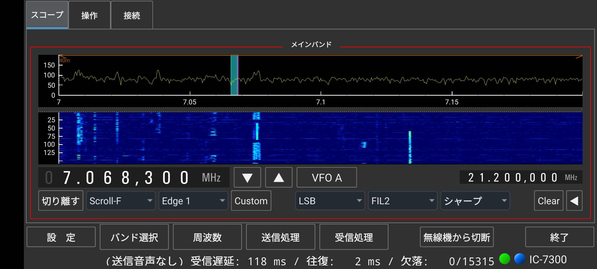
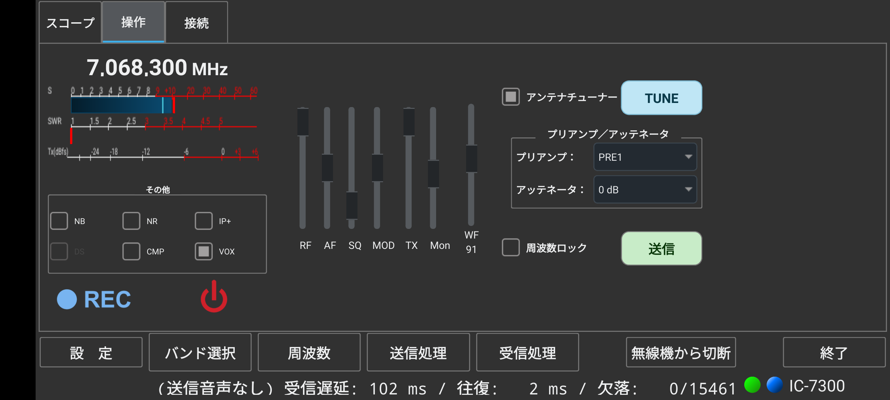

# wfview phone（wfview4android 携帯版）操作説明書

**wfview phone** は、CI-V 対応のリグ用コントロールソフト **wfview** の Android スマートフォン向け移植版（非公式フォーク）です。
Icom の LAN 対応リグ本体（IC-705 / IC-9700 / IC-7610 など）、または Raspberry Pi / PC で動作する **wfserver**（IC-7300 などを LAN 化）へ Wi-Fi／モバイル回線で接続し、
スペクトラム／ウォーターフォールを見ながら、同調・送受信・音声処理・録音を携帯から操作できます。

画面は iPhone 版と同じく **スコープ / 操作 / 接続** の 3 つのタブに分かれていて、横向きの携帯 1 画面に収まるようにしています。

- **対象端末**: Android 9 以降の Android スマートフォン（arm64-v8a）
- **画面の向き**: 横向き（ランドスケープ）全画面
- **画面の大きさ**: 端末の画面の短い辺に合わせて自動で拡大・縮小します。縦横比が 19.5:9〜20:9 程度の最近の機種向けです（16:9 など横が短い機種では右側が切れることがあります）
- **接続方式**: ネットワーク（Icom LAN プロトコル）のみ。USB／シリアル接続には対応していません
- タブレット向けには、ダイアルやメーターを 1 画面に並べた **タブレット版** があります（<https://github.com/kazushinjo/wfview_android-tablet>）。識別名が違うので、同じ端末に両方入れられます

本リポジトリは [wfview](https://wfview.org/)（GPLv3）の非公式フォークです。本家プロジェクトとは無関係の個人移植であり、不具合報告は本家ではなく本リポジトリへお願いします。

---

## 目次

1. [ダウンロードとインストール](#sec-1)
2. [接続（接続タブ）](#sec-2)
3. [画面全体の構成](#sec-3)
4. [スコープタブ（周波数の操作とスペクトラム）](#sec-4)
5. [操作タブ（メーター・スライダー・送信）](#sec-5)
6. [録音（REC）と電源](#sec-6)
7. [下段のボタンとポップアップ画面](#sec-7)
8. [基本操作の流れ（クイックスタート）](#sec-8)
9. [こんなときは（トラブルシューティング）](#sec-9)
10. [注意事項](#sec-10)
11. [タブレット版との違い](#sec-11)
12. [ビルド（開発者向け）](#sec-build)

---

## 1. ダウンロードとインストール

Google Play では配布していません。リリースページの APK を直接インストールします。

| 版 | ファイル | 対象 |
|----|----------|------|
| 携帯版 2026.10.10 | [wfview4android-phone-2026.10.10.apk](https://github.com/kazushinjo/wfview_android-phone/releases/download/v2026.10.10/wfview4android-phone-2026.10.10.apk) | Android スマートフォン |

すべてのリリースは [リリースページ](https://github.com/kazushinjo/wfview_android-phone/releases) にあります。
（本リポジトリは非公開のため、ダウンロードには GitHub のアカウントとリポジトリへのアクセス権が必要です。）

1. **動作条件**: Android 9 以降（arm64-v8a）
2. APK を端末へコピーし（ダウンロード／USB／クラウドなど）、ファイルマネージャでタップします
3. 「提供元不明のアプリのインストール」の確認が出たら、使用中のアプリ（ファイルマネージャ等）に**許可**を与えます
4. 初回起動時に**マイクへのアクセス許可**を求められるので「アプリの使用時のみ」を選びます（送信音声に必要。拒否すると変調がかかりません）
5. 開発者向け: `adb install -r wfview4android-phone-2026.10.10.apk`

> **以前の版からの入れ替えについて**
> 2026.10.10 から、携帯版は識別名を `org.wfview4android.phone`、アプリ名を「wfview phone」にし、リリース用の新しい鍵で署名しています。
> それより前に入れた版（アプリ名が wfview4android のもの）とは別のアプリとして入ります。古い版が不要ならアンインストールしてください。
> 2026.10.10 以降は同じ鍵で署名するので、次の版からは上書きでき、設定も残ります。

---

## 2. 接続（接続タブ）

画面左上の **接続** タブで、接続先の設定と接続をまとめて行います。

### 2-1. 接続先の設定（左側）

| 項目 | 内容 |
|------|------|
| **接続プロファイル** | 保存済みの接続先をプルダウンで選びます。**保存** で今の内容を名前付きで保存、**削除** で選択中のプロファイルを消します |
| **ホスト (IP)** | リグ本体または wfserver の IP アドレス（例: `192.168.1.20`）。タップすると数字・小数点・Back（1 文字削除）・クリアだけのテンキーが開きます |
| **コントロールポート** | 制御用ポート番号（既定 `50001`） |
| **シリアルポート (CAT)** | 既定 `50002` |
| **オーディオポート** | 既定 `50003` |
| **CI-Vアドレス (機種選択)** | 機種をプルダウンで選びます（例: `IC-7300 (0x94)`）。**自動 (Auto)** にするとリグから読み取ります |
| **ユーザー名 / パスワード** | wfserver（またはリグ本体のネットワーク設定）で決めた認証情報。タップすると半角英数字のキーボード（数字・英小文字・`- . _ @`、**大文字** で大文字に切り替え、Back、クリア）が開きます |

- テンキー／キーボードは押したそばから欄に入ります。キーボードの外をタップすると閉じます。
- 端末の日本語キーボードは使わないので、全角文字が入ることはありません。
- プロファイル名が空のまま保存しようとすると「プロファイル名を入力してください」と表示されます。

### 2-2. 遅延時間の調整（右側）

- **受信遅延時間 (RX Latency)** / **送信遅延時間 (TX Latency)**: 音声バッファの量です。
- 初期値は 500 ms です。値を大きくすると音切れしにくくなりますが、そのぶん応答が遅くなります。Wi-Fi では 100〜150 ms、モバイル回線で途切れるときは 200〜300 ms 程度から試してください。

### 2-3. 接続と切断

- **保存して接続**: 入力内容を保存して、そのまま接続を始めます。
- **保存のみ**: 保存だけして接続はしません。
- 接続できると、画面右下にリグ名が表示されます。リグの検出が終わると、機種に応じた操作部品が現れます。
- 切断するときは下段の **無線機から切断** をタップします（もう一度つなぐときは **接続**）。

下段の **設 定** をタップしても、この接続タブが開きます（携帯版には、タブレット版のような細かい設定画面はありません）。

---

## 3. 画面全体の構成

| 場所 | 内容 |
|------|------|
| 左上のタブ | **スコープ**（スペクトラム／ウォーターフォールと周波数、→ 4章）、**操作**（メーター・スライダー・送信、→ 5章）、**接続**（→ 2章） |
| 下段のボタン（どのタブでも共通） | **設 定 / バンド選択 / 周波数 / 送信処理 / 受信処理 / 接続（無線機から切断） / 終了**（→ 7章） |
| 最下行 | 受信状態の表示:（送信音声なし）・**受信遅延**・**往復**（往復時間）・**欠落**（失われたパケット数／受信したパケット数）・接続中のリグ名 |

- 「（送信音声なし）」は、送信用コーデックが無効で送信音声を送らない設定のときに出ます。
- 録音の開始・保存などのお知らせも最下行に表示されます。

---

## 4. スコープタブ（周波数の操作とスペクトラム）

### 4-1. 見方

- **スペクトラム（上段）**: 横軸が周波数、縦軸が信号の強さです。山（ピーク）が信号です。
- **ウォーターフォール（下段）**: 時間の流れを色で表示します（新しい表示が上から流れます）。明るい縦すじほど強い信号です。
- アマチュアバンドの範囲は、上端のバンド表示（例: `40m`）で示されます。

### 4-2. 周波数の合わせ方

| 方法 | 操作 |
|------|------|
| **ウォーターフォールをタップ** | 聞きたい信号の縦すじをタップすると、その周波数へすぐに同調します。いちばん手軽です |
| **桁タップ ＋ ▼ / ▲** | 周波数表示の合わせたい桁をタップすると、その桁が同調ステップになります。右の **▼ / ▲** で、そのステップずつ下げ／上げします（長押しで連続） |
| **周波数**（下段） | テンキーで周波数を直接入力します |
| **バンド選択**（下段） | バンドボタンでバンドを一気に移動します。タップすると画面は自動で閉じます |

- 携帯版には周波数ダイアルと RIT はありません。細かい調整は桁タップ＋▼ / ▲ で行います。
- 操作タブの **周波数ロック** がオンのときは周波数が変わりません。
- **VFO A**: VFO A と VFO B を切り替えます。右端の小さな周波数表示はサブ側（VFO B）の周波数です。

### 4-3. スコープとモードの操作

| 部品 | 動作 |
|------|------|
| **切り離す** | スコープを別画面に切り離して大きく表示します。もう一度押すと元に戻ります |
| **Scroll-F** などの表示モード | センター／固定／スクロールC／スクロールF を切り替えます |
| **Edge 1** などのエッジ | 固定表示のときの表示範囲（エッジ）を選びます |
| **Custom** | 表示範囲を自分で決めた固定エッジにします |
| **LSB / USB / CW …** | 運用モード |
| **FIL1 / FIL2 / FIL3** | 受信フィルター |
| **シャープ / ソフト** | フィルターの形（対応機のみ） |
| **Clear** | スペクトラムのピーク表示を消します |
| **◀** | スコープの詳細設定（表示の上限・下限、パスバンドなど）を開きます |

---

## 5. 操作タブ（メーター・スライダー・送信）

### 5-1. 周波数とメーター（左上）

- いちばん上に現在の周波数を大きく表示します（スコープタブを開かなくても確認できます）。
- その下に **S メーター → SWR メーター → Tx(dBfs) メーター** の 3 段があります。
  - **S メーター**: 受信信号の強さ。S9 を超える強い信号は +10dB / +20dB… と表示されます。
  - **SWR メーター**: 送信中のアンテナの整合状態。目安は **1.5 以下＝良好**、2 前後＝許容範囲、**3 以上＝要調整**。
  - **Tx(dBfs) メーター**: マイクの入力レベル。目安は -12〜-6 dBfs です。

### 5-2. その他（左下）

| スイッチ | 機能 |
|----------|------|
| **NB** | パルス性ノイズ（「パチパチ」）の除去 |
| **NR** | ランダムノイズ（「ザー」）の低減。かけ過ぎると音がこもります |
| **IP+** | 強い信号が近くにあって歪むときに |
| **DS** | 近接周波数の強い局によるかぶり対策（対応機のみ） |
| **CMP** | 送信音声のコンプレッサー（SSB の了解度向上）。かけ過ぎに注意 |
| **VOX** | 声で自動送信。誤動作に注意 |

### 5-3. スライダー（中央）

| スライダー | 機能 | 目安 |
|-----------|------|------|
| **RF** | 受信 RF ゲイン | 通常は最大。強い信号が多いバンドでは絞ると混信が減ります |
| **AF** | 受信音量 | 端末のメディア音量と連動します |
| **SQ** | スケルチ | 信号がないときのノイズを消します。FM で特に有効 |
| **MOD** | 変調レベル | **Mon** で自分の声を聞きながら、歪まない位置に合わせます |
| **TX** | 送信出力 | 必要最小限の出力で運用するのが基本です |
| **Mon** | 送信音のモニター | MOD や送信処理を調整するときに |
| **WF** | ウォーターフォールの色の濃さ（フロア） | 下に数値を表示します。ノイズで画面が明るすぎるときは上げ、弱い信号まで見たいときは下げます。値はすぐ保存され、次回の起動でも使われます |

### 5-4. チューナー・プリアンプ・送信（右側）

| 部品 | 動作 |
|------|------|
| **アンテナチューナー** | 内蔵アンテナチューナーを使う／使わない |
| **TUNE** | チューニングを始めます。チューナーが OFF だと失敗するので、**アンテナチューナー** にチェックを入れてから押してください |
| **プリアンプ** | 弱い信号を増幅します（OFF / PRE1 / PRE2）。強い信号が多いバンドではオフが無難です |
| **アッテネータ** | 強すぎる信号を弱めます。受信が歪む・S メーターが振り切れるときに |
| **周波数ロック** | 周波数を固定し、誤タッチによるずれを防ぎます |
| **送信**（緑） | PTT です。タップすると送信を始め、もう一度タップで受信に戻ります。送信中は自動的に周波数がロックされます |

> **送信前のチェック**: 周波数（バンドプランの範囲内か）・モード・出力・アンテナ（SWR）を確認してから送信してください。

---

## 6. 録音（REC）と電源

操作タブの左下に、**● REC** と電源の記号のボタンがあります。

- **● REC**: 送受信の音声を録音します。タップで録音を始め（赤い表示になります）、もう一度タップで保存します。
  - 左チャンネルが**受信**、右チャンネルが**送信**のステレオ WAV です。
  - ファイル名は `QSO年月日-時-分秒.wav`（例: `QSO20261010-21-0530.wav`）で、端末の「ドキュメント」フォルダに保存されます。開始時と保存時に、最下行に保存先が表示されます。
  - リグの電源が切れているときは押せません。
- **電源の記号**: リグ本体の電源を入／切します（赤＝ON）。電源を切ると、録音中の音声も保存して録音を止めます。

---

## 7. 下段のボタンとポップアップ画面

| ボタン | 動作 |
|--------|------|
| **設 定** | **接続** タブを開きます（→ 2章） |
| **バンド選択** | バンドを選ぶ画面を開きます（→ 4-2） |
| **周波数** | テンキーで周波数を入力する画面を開きます。テンキーの **Back** は 1 桁削除です |
| **送信処理** | マイク音声のコンプレッサー・イコライザー・ノイズゲート。効き具合は **Mon** で聞きながら調整します |
| **受信処理** | 受信音のノイズリダクションとイコライザー。まずリグ側の NR を試し、足りなければこちらを足す順がおすすめです |
| **接続 / 無線機から切断** | 接続と切断（→ 2-3） |
| **終了** | アプリを終了します。誤操作防止のため **2 秒以内にもう一度タップ** すると終了します |

- ポップアップ画面は、左上の **← 戻る** ボタンでメイン画面に戻ります。
- 画面に収まらない内容は、スワイプでスクロールします。

---

## 8. 基本操作の流れ（クイックスタート）

1. **接続** タブで接続先を入力し、プロファイル名を付けて **保存して接続** をタップします（2 回目からはプロファイルを選んで **保存して接続** だけ）。
2. 右下にリグ名が表示され、操作部品が現れるのを待ちます。
3. **スコープ** タブで **バンド選択** からバンドを選び、**ウォーターフォールをタップ**して信号に同調します。桁タップ＋▼ / ▲ で追い込みます。
4. **操作** タブの **AF**（音量）と **SQ**（スケルチ）で受信音を整えます。ノイズが多ければ **NR / NB** を試します。
5. 送信前に **アンテナチューナー** にチェックを入れて **TUNE** で整合します（SWR メーターで確認）。
6. **送信** で送信します。**MOD** と **Mon** で変調を確認します。
7. 交信を残したいときは **● REC** で録音します。
8. 運用が終わったら **無線機から切断** をタップします。

---

## 9. こんなときは（トラブルシューティング）

| 症状 | 確認すること |
|------|--------------|
| 接続できない | ホスト・ポート・ユーザー名・パスワード。リグまたは wfserver が動いているか。外出先からの接続ではルーターのポート開放や VPN が必要です |
| 接続はできるが音が出ない | AF スライダー、SQ、端末のメディア音量 |
| 音が途切れる | 最下行の **欠落** が増えていないか。接続タブで **受信遅延時間** を大きくする |
| 送信できない・変調が浅い | MOD スライダー、送信処理の設定、Android のマイク権限。最下行に「（送信音声なし）」が出ていないか |
| TUNE が失敗する | **アンテナチューナー** にチェックが入っているか。アンテナがつながっているか |
| REC が押せない | リグの電源が入っているか（電源の記号が赤か） |
| 周波数が変えられない | 操作タブの **周波数ロック** がオンになっていないか |
| 画面のボタンが少ない | リグの検出中です。接続が終わるまでお待ちください（機種が対応していない機能は表示されません） |
| 画面の右側が切れる | 縦横比が 16:9 前後の端末です。19.5:9〜20:9 程度の端末向けに作っています |

---

## 10. 注意事項

- 送信の変調には**マイク権限**が必要です。初回起動時に「許可」を選んでください（あとから変えるときは Android の設定 → アプリ → wfview phone → 権限）。
- マイク入力は **内蔵マイク** をおすすめします。Bluetooth イヤホンのマイクは、Android の録音経路（SCO）に未対応のため音声が取れません（受信音の Bluetooth 再生は問題ありません）。
- モバイル回線で使うときは通信量に注意してください。スペクトラムと音声で常にデータが流れます。
- 送信を伴う操作（送信・チューン）は、周波数・出力・アンテナ・免許の範囲を確認のうえ、自己責任で行ってください。電波の発射は電波法令の範囲内で行ってください。
- 本アプリはデスクトップ版 wfview（GPLv3）を Android 向けに作り直したものです。細かな動作は本家 wfview に準じます。本家の情報は <https://wfview.org/> を参照してください。

---

## 11. タブレット版との違い

携帯の小さな画面に収めるため、タブレット版から次のものを省いています。

- 周波数ダイアル、RIT、同調ステップのプルダウン（スコープタブの桁タップ＋▼ / ▲ で代用）
- CW 送信、レピータ／スプリット、メモリーモードの画面
- 細かい設定画面（コーデック・配色など）と、保存・状態・ログ表示・機種編集・ヘルプのボタン（設定は終了時に自動で保存されます）

代わりに、送受信の **録音（REC）** と、接続設定をまとめた **接続** タブを加えています。

---

## ビルド（開発者向け）

macOS ホストでのビルド手順は [`ANDROID_BUILD_NOTES_MAC.md`](ANDROID_BUILD_NOTES_MAC.md)、
Windows ホストは [`ANDROID_BUILD_NOTES.md`](ANDROID_BUILD_NOTES.md) を参照してください（手順はタブレット版と同じです）。
リリース APK はリリース用の鍵で署名します（鍵はリポジトリには含めません）。
